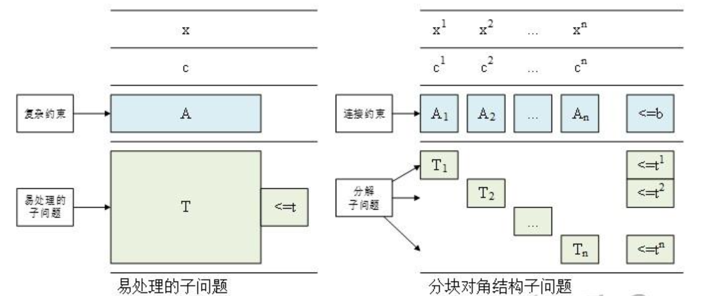

# 学习资料
张树柱老师的DW分解课程：

- 知乎课件：<https://zhuanlan.zhihu.com/p/524111484>

- B站网课：<https://www.bilibili.com/video/BV1k3411V7FG?spm_id_from=333.788.recommend_more_video.20&trackid=web_related_0.router-related-2206146-wxmlq.1761879901781.498&vd_source=1c1c9d895c2baf1bb8ad3b5e5d47051f>

# 背景
- **DW 分解**是针对**块角（block–angular）结构**的大规模线性/混合整数规划的分解方法。  
- **思想：**把原问题中彼此独立的“子块”保留在各自可行域内求解，只通过少量**耦合约束**（资源/平衡）连接，然后用**列生成**逐步丰富主问题的列。  
- 与**列生成（CG）**的关系：DW 把“多面体可行域”写成**极点 + 极方向**的凸/锥组合；列就是这些极点/极方向在主问题中的权重。

# 原理
## 原问题
DW分解适用于块角结构的问题。设共有 $S$ 个子块，决策 $x=[x_1;\dots;x_S]$ 。

$$
\begin{aligned}
\min \quad   & \sum_{s=1}^S c_s^\top x_s \\
\text{s.t.}\quad
             & \sum_{s=1}^S A_s x_s \le b \quad \text{(耦合/系统约束)}\\
             & B_s x_s \le d_s,\quad x_s \ge 0 \qquad (s=1,\dots,S).
\end{aligned}
$$

这里 \(A_s\) 只出现在少量系统级约束中，而 \(B_s\) 仅作用于各自子块。

## 极点 + 极方向表示

基于Minkowski定理，记子块可行域 $X_s=\{x_s\mid B_s x_s\le d_s,\ x_s\ge 0\}$。存在极点集 $V_s=\{v_s^k\}$ 与极方向集 $D_s=\{d_s^r\}$，使

$$
x_s=\sum_{k\in\mathcal K_s}\lambda_{sk}v_s^k+\sum_{r\in\mathcal R_s}w_{sr}d_s^r,\qquad
\sum_k \lambda_{sk}=1,\ \lambda_{sk}\ge 0,\ w_{sr}\ge 0 .
$$

## 限制主问题（RMP）

把上式代回原问题，得到列形式主问题；实际只保留少量列形成 RMP：

$$\min\quad \sum_{s}\sum_{k} (c_s^\top v_s^k)\lambda_{sk}+ \sum_{s}\sum_{r} (c_s^\top d_s^r)w_{sr}$$

$$\text{s.t.}\quad \sum_{s}\sum_{k} (A_s v_s^k)\lambda_{sk} + \sum_{s}\sum_{r} (A_s d_s^r)w_{sr} \le b,$$

$$\sum_{k}\lambda_{sk}=1 \ (s=1,\dots,S),$$

$$\lambda_{sk}\ge0,\ w_{sr}\ge0$$

## 对偶主问题（Dual RMP）
把耦合约束写成 $\sum_s A_s x_s \le b$ ，其对偶为 
$(\pi \ge 0)$ ；每个子块的凸性等式 $\sum_k \lambda_{sk}=1$ 的对偶为自由变量 $\mu_s$ 。

$$
\max \ b^\top \pi + \sum_{s}\mu_s
$$

对极点列（对所有 $s$ 与 $t\in\mathcal T_s$）：

$$
(A_s v_s^t)^\top \pi + \mu_s \le c_s^\top v_s^t
$$

对极方向列（若存在，对所有 $s$ 与 $r\in\mathcal R_s$）：

$$
(A_s d_s^r)^\top \pi \le c_s^\top d_s^r
$$

对偶变量取值域：

$$
\pi \ge 0
$$

$$
\mu_s \in \mathbb{R}
$$

> 对最小化问题，若存在一列使 $\bar c < 0$，意味着把这列少量加入会降低目标值，当前 RMP 还不最优；因此需要把它加入。反之，若所有列的约化成本都不负，则 RMP 已经是原问题的最优。最大化问题只需把不等号方向反过来：出现 $\bar c > 0$ 的列就应加入，直到 $\bar c(\cdot) \le 0$ 。

> 读对偶时，RMP 建议用单纯形（如 Gurobi `Method=1`），以确保可以取到约束的 `.Pi`。 

## 定价子问题（Pricing）

给定当前对偶 $(\pi,\mu)$，对每个子块 $s$ 解：

### 极点定价（点子问题）
$$
\min_{x_s}\ (c_s-A_s^\top\pi)^\top x_s-\mu_s
\quad\text{s.t.}\quad B_s x_s\le d_s,\ x_s\ge0 .
$$

### 极方向定价（方向子问题）
$$
\min_{d}\ (c_s-A_s^\top\pi)^\top d
\quad\text{s.t.}\quad B_s d\le 0,\ d\ge0 .
$$

若点子问题无界，应求方向子问题并把方向列加入 RMP（方向列不受凸性等式约束）。

# 算法步骤

1. **初始化**：每个子块给出至少一个可行极点，初始化列集合。设容差 $\varepsilon>0$。
2. **解 RMP**：得到目标值 $z_{\text{RMP}}$ 与对偶 $(\pi,\mu)$；更新 $UB=\min(UB,\ z_{\text{RMP}})$。
3. **定价**：对每个子块解点/方向子问题；若出现 $\bar c<-\varepsilon$ （最小化问题）的列则加入 RMP。
4. **收敛判据**：若无改进列，则迭代停止，否则返回步骤 2。

# 例子
## 问题描述
**Maximize**

$$\max 14x_1 + 8x_2 + 11x_3 + 7x_4$$

$$2.1x_1 + 2.1x_2 + 0.75x_3 + 0.75x_4 \le 60$$

$$0.5x_1 + 0.5x_2 + 0.5x_3 + 0.5x_4 \le 25$$

$$x_1 + x_2 \ge 22$$

$$x_1 \le 20$$

$$x_3 + x_4 \ge 12$$

$$x_3 \le 15$$

$$x_4 \le 25$$

$$x_1,x_2,x_3,x_4 \ge 0$$

将变量分为 $\{x_1,x_2\}$ 与 $\{x_3,x_4\}$ 两部分，对应两个子问题。令

$$c_1={\[14,8\]}^T,\quad c_2={\[11,7\]}^T,$$

$$A_1=\[ \[2.1,2.1\], \[0.5,0.5\] \],\quad A_2=\[ \[0.75,0.75\], \[0.5,0.5\] \],\quad b={\[60,25\]}^T.$$

- 子问题1约束：

$$x_1+x_2\ge 22, x_1\le 20.$$

- 子问题2约束：

$$x_3+x_4\ge 12, x_3\le 15, x_4\le 25.$$
  
## 手动求解

